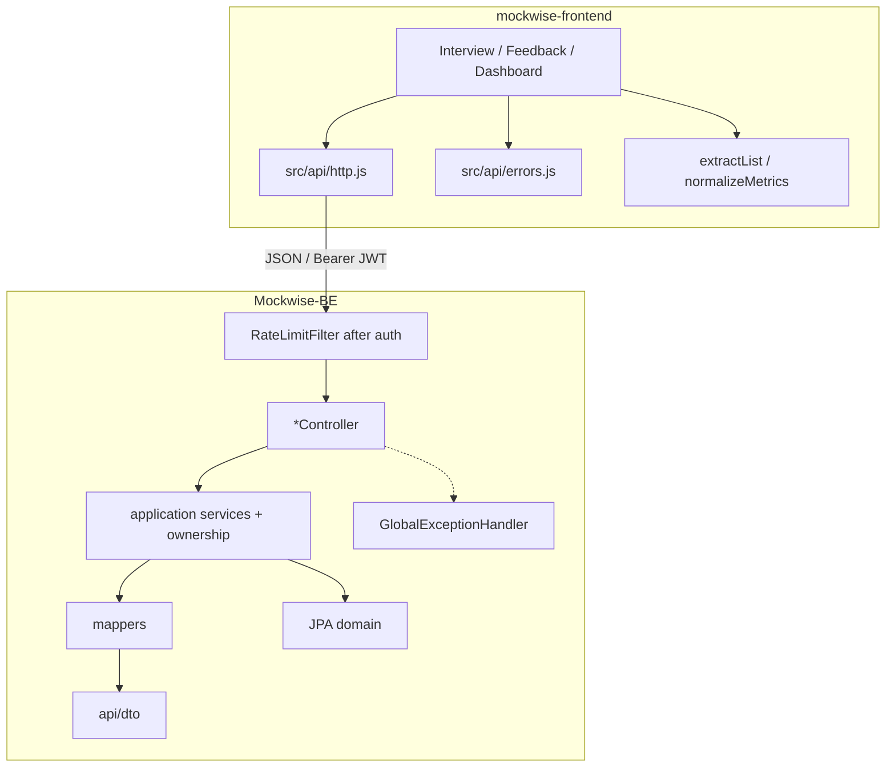
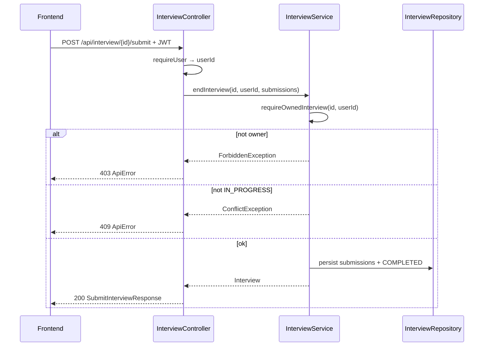
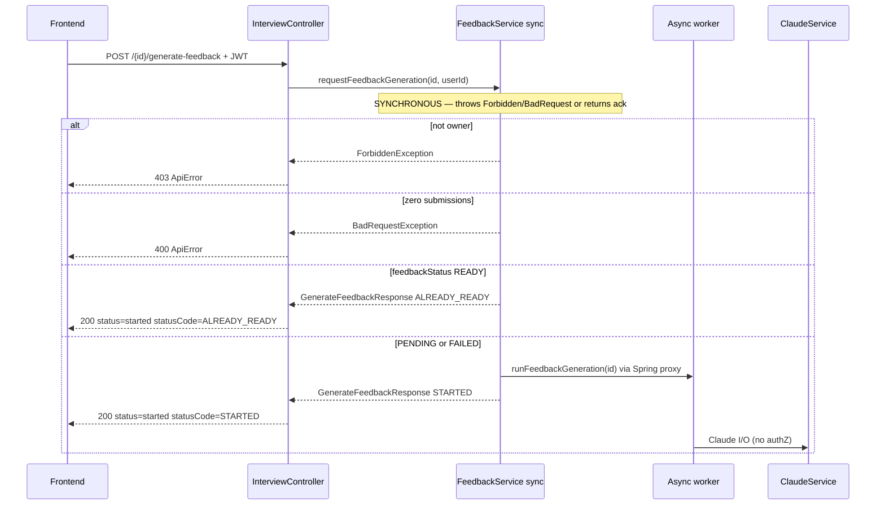
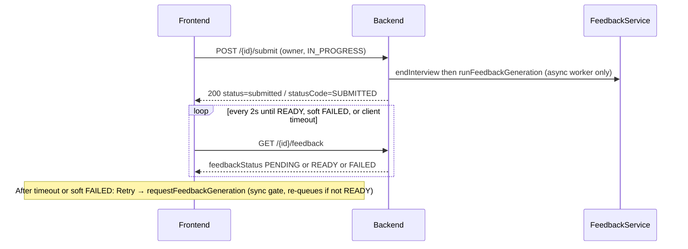
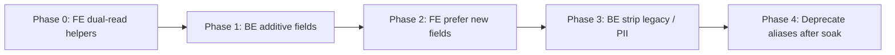

# MockWise Production-Ready API Design (Backend ↔ UI Contract)

| Field | Value |
|-------|--------|
| **Document** | Production-ready API design for MockWise |
| **Author** | _TBD_ |
| **Date** | 2026-07-25 |
| **Status** | Draft (Rev 3 — @Async feedback gate + re-review nits) |
| **Scope** | Backend (`Mockwise-BE/`, package `com.mockwise.backend`) ↔ Frontend (`mockwise-frontend/`) HTTP contract |
| **Related** | `docs/architecture.md`, `docs/local-api-endpoints.md`, `mockwise-frontend/docs/PRODUCTION_READINESS_REQUIREMENTS.md` (P4 API layer) |

---

## Overview

MockWise is a mock coding-interview product. The backend is Spring Boot under `Mockwise-BE/` (`com.mockwise.backend`); the frontend is React (Vite) under `mockwise-frontend/`. Authentication is Supabase JWT; `SecurityConfig` requires auth on essentially all `/api/**` routes.

A deep audit found a partially mature error layer (`ApiError`, `ErrorCode`, `GlobalExceptionHandler`) alongside **ad-hoc success payloads**: controllers return `Map.of(...)`, bare entity graphs, and bare arrays; request DTOs lack Bean Validation; ownership checks are inconsistent; and the frontend systematically misreads the contract (errors via `.error` not `.message`, stub object treated as string, syntax success invents fake “error” strings).

This document defines a **production-ready, resource-shaped API contract**, canonical request/response DTOs for every endpoint, a unified syntax-check shape for Monaco, entity-leak prevention, validation and authZ rules (service-layer), a backward-compatible migration path with **explicit dual-read coverage for every consumer**, package layout, testing strategy, frontend consumption plan (aligned with P4 paths), deprecations with measurable exit criteria, release gates, and an incremental **PR Plan**.

**Core principle:** protocol/auth failures → 4xx/5xx `ApiError`. Business outcomes (syntax fail, feedback pending) → HTTP 200 + structured body. Prefer extending existing `ApiError` over inventing a new error envelope. Prefer no heavy `{data: T}` wrapper; resource objects + `{items, count}` for collections.

---

## Background & Motivation

### Current architecture (relevant facts)

| Area | Location | Notes |
|------|----------|--------|
| Interview API | `interview/api/InterviewController.java` | 12+ endpoints; mixes maps, entities, lists |
| Code syntax | `codesyntax/CodeSyntaxController.java` + `SyntaxCheckFacade` | Richer `{success, errors, toolStatus}`; **unused by FE** |
| Interview syntax | `POST /api/interview/check-syntax` | Returns only `{errors: List<String>}` via `SyntaxCheckService` adapter |
| Dashboard | `dashboard/api/DashboardController.java` | Metrics as `Map`; progress as bare array |
| Errors | `common/exception/*` | Solid; `ApiError` already has `timestamp, status, error, code, message, path, details, meta` |
| Auth | `auth/SecurityConfig.java`, `SupabaseAuthFilter` | JWT required for `/api/**` (`/` `/health` `/error` public only) |
| Domain | `Interview`, `Question`, `UserSubmission` | JPA entities serialized on the wire today |

### Progress endpoint consumers (critical for migration)

`GET /api/dashboard/progress` is consumed by **three** FE modules that all assume a bare array today:

| File | Current usage | Failure if wrapped without dual-read |
|------|---------------|--------------------------------------|
| `dashboard/ProgressChart.jsx` | `progressResult.data.map(...)` | Runtime throw / empty chart |
| `dashboard/InterviewHistory.jsx` | `Array.isArray(result.data) ? result.data : []` | **Silent empty history table** |
| `dashboard/ProgressGraph.jsx` | `(resp.data \|\| []).map(...)` | Empty graph |

Any collection wrap **must** ship dual-read in all three first (shared `extractList`).

### Pain points (must fix)

1. **Entity leak** — `Interview` serializes `userId` and `userEmail` (no `@JsonIgnore`). Clients should never receive other users’ PII; even own email is unnecessary for most responses. `UserSubmission` embeds full `Question` graphs via lazy/eager loads.
2. **Inconsistent success shapes** — `Map.of`, bare `List`, raw entities; FE must special-case every call.
3. **Weak request validation** — request DTOs have no Jakarta `@Valid` / constraints; controllers do manual null checks.
4. **AuthZ gaps (service-level)** — `validateInterviewAccess` only on `GET /{id}/validate`. Missing ownership on:
   - `POST /{id}/submit` → `InterviewService.endInterview` loads by id only; attacker can complete another user’s interview and pollute `markQuestionsAsSeen`
   - `GET /{id}/feedback` → loaders by id only; returns email + full code
   - `POST /{id}/generate-feedback` → Claude cost for any UUID
5. **FE contract bugs** (confirmed in source):
   - Stub: BE `{stub: "..."}`; FE treats body as string → **always empty** (`InterviewSession.jsx`)
   - Errors: FE uses `error.response?.data?.error` (HTTP reason phrase) instead of `.message` / `.code`
   - Syntax: success string stuffed into `errors[]`; green badge for error counts
   - Languages: FE hardcodes java/python/cpp; BE has 10 toolchains
   - Feedback: polls null `claudeFeedback`; no `feedbackStatus`
6. **Dual syntax endpoints** — lossy interview path vs richer codesyntax path.
7. **Display formatting on server** — `lastMockDate` as `"MMM d, yyyy"`; progress difficulty as `"Easy"`.
8. **Dev endpoint** — `GET /api/interview/test-auth` should not ship in production.
9. **Dead soft-auth path** — `GET /questions` try/catch around `requireUser` is unreachable for anonymous callers under current `SecurityConfig` (filter returns 401 first). Cleanup-only, not a residual auth hole.

### Syntax/compilation (secondary to contract)

- Product FAQ: **syntax-check only during interview**, not full run/judge.
- Judge0 is config-only; not implemented.
- Structured diagnostics (start/end line/col + severity) needed for Monaco.
- Known runtime risks: Docker JRE breaks Java compile; process timeouts — **follow-on**.

---

## Goals & Non-Goals

### Goals

1. Define a single **API rulebook** all controllers follow.
2. Introduce **canonical DTOs** for every public endpoint (request + response).
3. Unify syntax-check response with Monaco-ready diagnostics + `toolStatus`.
4. Stop serializing JPA entities / user identifiers on the wire.
5. Adopt `@Valid` + aligned size limits; minimal per-user rate limits on abuse-prone endpoints.
6. Enforce ownership in the **service layer** on all interview-scoped mutations/reads.
7. Ship via **incremental, backward-compatible** BE+FE rollouts with release gates.
8. Package layout under feature modules + `common`.
9. Contract tests from the first security/DTO PRs (not only at the end).
10. Frontend: P4-aligned error helper + shared HTTP client, stub/syntax/language/feedback fixes.
11. Deprecations with measurable soak criteria.
12. Ordered, mergeable **PR plan** (split large DTO work).

### Non-Goals

- Implementing Judge0 / full code execution or scoring against hidden tests.
- Rewriting Claude prompt/schema or feedback content format (JSON string in `claudeFeedback` stays; we add status envelope).
- Migrating frontend to TypeScript (JSDoc/types file is enough for this wave).
- Database schema redesign / Flyway baseline (no required migrations for DTO-only contract).
- Changing Supabase auth provider or moving off JWT.
- **OpenAPI / springdoc as a blocking deliverable for this wave** (see KD-13) — golden JSON + forbidden-key tests are the contract source of truth for now.
- Distributed (Redis) rate limiting — in-process only in this wave; multi-instance caveat documented.
- API path versioning (`/api/v2`) — dual-field deprecation within `/api` only.

---

## Key Decisions

| # | Decision | Rationale |
|---|----------|-----------|
| KD-1 | **Keep `ApiError` as the sole error envelope**. | Already wired in handlers; FE bug is read-side. |
| KD-2 | **No global `{data: T}` success wrapper.** Collections use `{items, count}`. | Lower FE churn; matches partial existing shapes. |
| KD-3 | **Never serialize JPA entities on the wire.** | PII, LazyInit (`open-in-view: false`), accidental fields. |
| KD-4 | **IDs are string UUIDs on the JSON wire.** Java request DTOs may use `java.util.UUID` (Jackson binds strings either way); response DTOs use `String id` for explicit client docs. | Wire format is always a UUID string; no client codegen asymmetry risk beyond docs. |
| KD-5 | **Domain enums uppercase on wire** (`EASY`, `IN_PROGRESS`, `AVAILABLE`). Display formatting only in UI. | Standardizes contract. |
| KD-6 | **Timestamps ISO-8601 Instant.** No server-side `"MMM d, yyyy"`. | Locale belongs in the browser. |
| KD-7 | **Business outcomes = HTTP 200 + body.** Protocol failures = 4xx/5xx `ApiError`. | Aligns with syntax/feedback polling. |
| KD-8 | **Canonical syntax: `POST /api/codesyntax/check`**; interview path is thin alias (deprecated). | Single facade implementation. |
| KD-9 | **Ownership is mandatory in service methods** that take `interviewId` for read/mutate (`endInterview`, feedback load, generate-feedback gate). Controllers still pass `userId`; tests cover **service** non-owner paths. | Controllers-only fixes leave IDOR if any other caller appears. |
| KD-9b | **Feedback generation is two-phase:** sync `requestFeedbackGeneration(interviewId, userId)` on the request thread (ownership, has-submissions, READY short-circuit → throws or returns ack DTO), then async `runFeedbackGeneration(interviewId)` with **no authZ**. Never put gates only inside the existing `@Async generateFeedbackForInterview` — that method already swallows exceptions and returns after the controller has sent 200. | Naive `@Async` gate yields HTTP 200 for non-owners; ALREADY_READY cannot shape the response body. |
| KD-10 | **`feedbackStatus` is derived** (no DB column first). Soft `FAILED` when interview ended and feedback still incomplete after threshold `T` (default 10 minutes). **Re-queue** generate-feedback when status is `PENDING` or `FAILED`; only `READY` → `ALREADY_READY` without work. | No Flyway; improves polling UX; Retry after soft FAILED must start work again. |
| KD-14b | **No submissions on generate-feedback → 400** `BAD_REQUEST` (“nothing to evaluate”). Reserve **409** for lifecycle conflicts (e.g. submit when not `IN_PROGRESS`). Soft `FAILED` is not a conflict — re-queue with 200 `STARTED`. | Single code for contract tests; avoids 400/409 dual wording. |
| KD-11 | **Additive compatibility first** + dual-read on **every** known consumer before shape wrap. | Prevents silent empty UI (InterviewHistory). |
| KD-12 | **Minimal in-process rate limits** on `POST …/generate-feedback` and syntax-check (key=`userId` after auth). Multi-instance is best-effort only. | Claude cost / process abuse without Redis dependency. |
| KD-13 | **Contract source of truth for this wave = golden JSON + forbidden-key tests**, not OpenAPI. OpenAPI/springdoc is optional follow-on. Golden files update **in the same PR** as DTO shape changes. | Single first-party client; avoids springdoc dependency before DTO stability. |
| KD-14 | **Submit lifecycle**: reject if status ≠ `IN_PROGRESS` → **409 CONFLICT**. Validate every `questionId` ∈ interview assigned set → **400** if not. Double-submit of completed interview is not allowed. | Closes lifecycle abuse after ownership fix. |
| KD-15 | **Action-ack status fields**: keep legacy lowercase `status` values during transition (`"started"`, etc.); add optional `statusCode` SCREAMING_SNAKE (`STARTED`, `SUBMITTED`, `ALREADY_READY`). `SUBMITTED` is **action ack**, not domain `Interview.Status` (which becomes `COMPLETED`). | Avoids unversioned breaks on exact string checks. |
| KD-16 | **Product validation defaults** (until product overrides): questions 1–10; time 5–180 min; submissions max **10** (matches max questions); code max 200_000 chars; syntax code `@NotBlank`; submit code `@NotNull` (empty string allowed — incomplete answers). | Removes open-question drift across PRs. |

---

## API Design Principles / Rulebook

### R1 — Response shapes

| Kind | Shape | Example |
|------|--------|---------|
| Single resource | Object with stable field names | `InterviewSummaryResponse` |
| Composite resource | Named fields, not anonymous maps | `{ interview, questions, remainingTimeMs, valid }` |
| Collection | `{ "items": [...], "count": N }` | Progress, questions list, languages |
| Action ack | `status` (legacy string) + optional `statusCode` | see KD-15 |
| Error | `ApiError` only | see R2 |

### R2 — Error contract (unchanged envelope)

```json
{
  "timestamp": "2026-07-25T12:00:00Z",
  "status": 400,
  "error": "Bad Request",
  "code": "VALIDATION_ERROR",
  "message": "One or more fields are invalid.",
  "path": "/api/interview/start",
  "details": ["numQuestions: must be between 1 and 10"],
  "meta": null
}
```

Client rules (aligns with amended P4 REQ-P4-03):

1. Prefer **`message`**.
2. Else join **`details`** if present.
3. Branching: prefer **`code`**.
4. **`error`** (HTTP reason phrase) only as last-resort fallback if safe length &lt; 300 and not a generic reason like `"Bad Request"` alone when `message` exists.

### R3 — Auth & ownership

- All `/api/**` require valid Supabase JWT (existing filter).
- Controllers: `AuthSupport.requireUser(authentication)`.
- Interview-scoped **service** methods require `userId` and call `validateInterviewAccess` / `requireOwnedInterview` **internally** before load/mutate.
- Controllers must not call “by id only” service entry points for owner-scoped resources.

### R4 — Validation

- `@Valid` on all request bodies; aligned limits per KD-16.
- Prefer annotations over manual null checks.

### R5 — HTTP status semantics

| Situation | Status |
|-----------|--------|
| Success (empty progress, syntax errors, feedback pending) | 200 |
| Validation / bad input / question not in interview | 400 |
| Missing/invalid JWT | 401 |
| Authenticated but not owner | 403 |
| Resource missing | 404 |
| Interview expired for recovery | 410 |
| Double-submit / not `IN_PROGRESS` / lifecycle conflict | **409 CONFLICT** |
| Rate limited | 429 `RATE_LIMITED` + `Retry-After` when known |
| Unexpected | 500 |
| DB down | 503 |

### R6 — Naming

- JSON fields: **camelCase**.
- Domain enums: uppercase. Action-ack legacy `status` may be lowercase during dual-run (KD-15).
- Paths: existing hyphenated paths kept for compatibility.

### R7 — No Map controllers

- Controllers return typed DTOs. Dual-field period may keep deprecated keys documented.

### R8 — Deprecation protocol

| Mechanism | Usage |
|-----------|--------|
| Docs | `Deprecated` label in `local-api-endpoints.md` + this design |
| Logs | WARN once per request on deprecated path (sampled if noisy) |
| Metrics | `mockwise.api.deprecated_hits{path=...}` counter |
| Headers (optional but recommended) | `Deprecation: true` and `Link: </api/codesyntax/check>; rel="successor-version"` on alias responses |
| Soak exit | Alias removed only when metric shows **zero FE traffic for 7 consecutive days** OR one full prod release cycle with FE on canonical path and soak confirmed — whichever policy ops prefers; default **7 days zero hits** |

Path versioning (`/api/v2`) remains rejected (single first-party client).

---

## Proposed Design

### Architecture (target)



### Ownership sequence (service-enforced)



### Feedback generation: sync gate then async worker (KD-9b)

Today `FeedbackService.generateFeedbackForInterview` is fully `@Async("feedbackTaskExecutor")` and the controller returns 200 immediately. Exceptions inside the async method are only logged. **All ownership / lifecycle / ALREADY_READY decisions MUST complete on the request thread before async dispatch.**



**Submit path:** after successful `endInterview(id, userId, …)` (ownership already proven), the controller may call **`runFeedbackGeneration(interviewId)`** (or a package-private fire method) **without** re-running the full gate. Optional re-check is fine but must not be *only* inside `@Async`.

### Feedback polling with derived status



---

## Canonical Request & Response DTOs (Before → After)

Package root: `com.mockwise.backend.<feature>.api.dto`.

### Shared

```java
public record CollectionResponse<T>(List<T> items, int count) {
  public static <T> CollectionResponse<T> of(List<T> items) {
    return new CollectionResponse<>(items, items.size());
  }
}
```

Wire domain enums: `EASY|MEDIUM|HARD`, `IN_PROGRESS|COMPLETED|ABANDONED`, `AVAILABLE|MISSING|FAILED`, `FeedbackStatus: PENDING|READY|FAILED`.

---

### 1. `POST /api/interview/start`

**Before:** unvalidated body; response raw `Interview` + `Question` entities (includes `userId`, `userEmail`).

**After:**

```java
public record StartInterviewRequest(
  @NotNull Question.Difficulty difficulty,
  @NotNull @Min(1) @Max(10) Integer numQuestions,
  @NotNull @Min(5) @Max(180) Integer timeMinutes
) {}

public record QuestionResponse(
  String id,
  String title,
  String description,
  String example,
  String constraints,
  Question.Difficulty difficulty
) {}

public record InterviewSummaryResponse(
  String id,
  Question.Difficulty difficulty,
  int numQuestions,
  int timeMinutes,
  Instant startedAt,
  Instant endedAt,
  Interview.Status status,
  Double overallRating
  // never: userId, userEmail, aggregated
) {}

public record StartInterviewResponse(
  InterviewSummaryResponse interview,
  List<QuestionResponse> questions
) {}
```

---

### 2. `POST /api/interview/{interviewId}/submit`

**Before:** no ownership; no status guard; appends submissions always.

**After — request:**

```java
public record SubmissionRequest(
  @NotNull UUID questionId,   // JSON string; see KD-4
  @NotNull @Size(max = 200_000) String code,  // empty string allowed
  @NotBlank @Size(max = 32) String language,
  @Size(max = 64) String timeComplexity,
  @Size(max = 64) String spaceComplexity
) {}

public record SubmitInterviewRequest(
  @NotNull @Size(min = 1, max = 10) @Valid List<SubmissionRequest> submissions
) {}
```

**After — response (action ack, KD-15):**

```json
{
  "interviewId": "90af7876-6cc3-43da-8e68-534f14012d45",
  "message": "Interview submitted successfully",
  "status": "submitted",
  "statusCode": "SUBMITTED"
}
```

Note: domain interview status after success is `COMPLETED`. Wire `status`/`statusCode` describe the **action**, not a claim that domain status equals `SUBMITTED`.

**Service contract:**

```java
// InterviewService — ownership + lifecycle required
@Transactional
public Interview endInterview(UUID interviewId, String userId, List<SubmissionRequest> submissions) {
  Interview interview = requireOwnedInterview(interviewId, userId);
  if (interview.getStatus() != Interview.Status.IN_PROGRESS) {
    throw new ConflictException("Interview is not open for submission.");
  }
  // Load assigned question IDs INSIDE this @Transactional method
  // (Interview.assignedQuestionLinks is LAZY; open-in-view=false).
  // Prefer InterviewQuestionRepository.findByInterview_Id… or join fetch;
  // do not touch uninitialized lazy collections outside the TX.
  // Reject any submission.questionId not in that set with BadRequestException (400) BEFORE save.
  // persist submissions, set COMPLETED, return
}
```

---

### 3. `GET /api/interview/{interviewId}/feedback`

**Before:** raw entities; no ownership; no status.

**After:**

```java
public enum FeedbackStatus { PENDING, READY, FAILED }

public record SubmissionFeedbackResponse(
  String id,
  QuestionResponse question,
  String code,
  String language,
  Instant submittedAt,
  String claudeFeedback,
  Instant feedbackGeneratedAt,
  String userTimeComplexity,
  String userSpaceComplexity,
  boolean feedbackReady
) {}

public record FeedbackResponse(
  InterviewSummaryResponse interview,
  List<SubmissionFeedbackResponse> submissions,
  FeedbackStatus feedbackStatus,
  int readyCount,
  int totalCount
) {}
```

**Derivation (no DB column):**

```text
totalCount = submissions.size()
readyCount = count(non-blank claudeFeedback)
if totalCount == 0 → PENDING
else if readyCount == totalCount → READY
else if interview.endedAt != null
      && Duration.between(endedAt, now) > feedbackFailedAfter (default 10m)
      && readyCount < totalCount → FAILED   // soft failure (Claude error / stuck)
else → PENDING
```

**Service:** `getInterviewWithFeedback(id, userId)` and `getSubmissionsWithFeedback(id, userId)` call `requireOwnedInterview` first.

**FE after client poll timeout still PENDING, or when `feedbackStatus === FAILED`:** show “Feedback is delayed” + Retry button that calls `POST …/generate-feedback`. Retry is **not** a no-op for FAILED/PENDING (see §5); only READY is idempotent without work.

---

### 4. `GET /api/interview/questions/{questionId}/stub`

```java
public record CodeStubResponse(
  String questionId,
  String language,
  String stub
) {}
```

Keep `stub` field. FE dual-read: `data?.stub ?? (typeof data === 'string' ? data : '')`.

---

### 5. `POST /api/interview/{interviewId}/generate-feedback`

**Current bug risk:** controller calls `@Async void generateFeedbackForInterview(interviewId)` and returns 200 with `{status: started}` before any authZ. Putting gates only inside that method cannot produce 403/400 or ALREADY_READY in the HTTP body.

#### Required two-phase `FeedbackService` API (KD-9b)

```java
/**
 * SYNCHRONOUS — request thread only. Throws ApiException subclasses for authZ/validation.
 * Returns ack DTO the controller serializes. Never @Async.
 */
public GenerateFeedbackResponse requestFeedbackGeneration(UUID interviewId, String userId) {
  Interview interview = interviewService.requireOwnedInterview(interviewId, userId); // 403 if not owner
  List<?> submissions = /* load for interview */;
  if (submissions.isEmpty()) {
    throw new BadRequestException("Nothing to evaluate: interview has no submissions."); // 400 KD-14b
  }
  FeedbackStatus status = deriveFeedbackStatus(interview, submissions);
  if (status == FeedbackStatus.READY) {
    return new GenerateFeedbackResponse(interviewId.toString(), "started", "ALREADY_READY",
        "Feedback is already available.");
  }
  // PENDING or FAILED → re-queue (FAILED is not ALREADY_READY)
  // Must invoke async via Spring proxy / separate bean — NOT this.runFeedbackGeneration self-call
  asyncFeedbackWorker.runFeedbackGeneration(interviewId);
  return new GenerateFeedbackResponse(interviewId.toString(), "started", "STARTED",
      "Feedback generation has been started.");
}

/**
 * ASYNC worker — NO ownership checks (caller already gated or is trusted submit path).
 * Package-private or dedicated @Component; rename of today's generateFeedbackForInterview body.
 * Continues to swallow internal Claude errors for resilience (status stays PENDING/soft FAILED).
 */
@Async("feedbackTaskExecutor")
public void runFeedbackGeneration(UUID interviewId) { /* existing Claude loop */ }
```

**Self-invocation rule:** `@Async` on a method called as `this.runFeedbackGeneration(...)` does **not** go through the Spring proxy. Use a second bean (e.g. `FeedbackGenerationWorker`) or inject self via proxy.

#### Sync gate rules (request thread)

| Condition | HTTP | Body |
|-----------|------|------|
| Not owner | **403** `FORBIDDEN` | `ApiError` |
| Zero submissions | **400** `BAD_REQUEST` (KD-14b) | `ApiError` message “nothing to evaluate…” |
| Derived `feedbackStatus == READY` | **200** | `status=started`, `statusCode=ALREADY_READY` — **do not** start worker |
| Derived `PENDING` or soft `FAILED` | **200** | `status=started`, `statusCode=STARTED` — **always re-queue** worker |
| Optional: interview not yet COMPLETED but has submissions | **200** re-queue allowed (submit races); do not require COMPLETED if submissions exist |

After re-queue from soft `FAILED`, subsequent GET feedback shows `PENDING` until READY or the soft-FAILED threshold applies again.

#### Submit path (fire-and-forget after ownership)

```java
// InterviewController.submit after endInterview succeeds:
feedbackService.runFeedbackGeneration(interviewId); // async worker only; ownership already proven
// do NOT call requestFeedbackGeneration again unless you want ALREADY_READY semantics on re-submit (re-submit is 409)
```

#### Response examples (compat)

```json
// STARTED (new work)
{ "interviewId": "...", "status": "started", "statusCode": "STARTED",
  "message": "Feedback generation has been started." }

// ALREADY_READY (no new work)
{ "interviewId": "...", "status": "started", "statusCode": "ALREADY_READY",
  "message": "Feedback is already available." }
```

Legacy lowercase `"status": "started"` **retained**. New clients prefer `statusCode`.

---

### 6. `GET /api/interview/questions`

**Before:** bare `List<Question>`; dead soft-auth try/catch.

**After:** always `requireUser` (no catch); return `CollectionResponse<QuestionResponse>` / `{items, count}`. Remove dead catch as cleanup when touching endpoint.

---

### 7. `GET /api/interview/{interviewId}/validate`

Ownership already present. Return DTOs: `ValidateInterviewResponse(interview, questions, remainingTimeMs, valid)` — no PII entities.

---

### 8. `GET /api/interview/optimal-code`

```java
public record OptimalCodeResponse(String questionId, String language, String code) {}
```

Keep top-level `code` for FE dual-read.

---

### 9. `GET /api/interview/test-auth` — deprecate / profile-gate

`@Profile({"local","dev"})` short-term; delete in cleanup PR. Not available in prod.

---

### 10. Unified syntax check

#### Canonical: `POST /api/codesyntax/check`  
#### Alias (deprecated): `POST /api/interview/check-syntax` → identical body + deprecation headers/metrics

```java
public record CheckSyntaxRequest(
  @NotBlank @Size(max = 32) String language,
  @NotBlank @Size(max = 200_000) String code   // empty code → 400 VALIDATION_ERROR
) {}

public enum DiagnosticSeverity { ERROR, WARNING, INFO }

public record SyntaxDiagnostic(
  Integer line,          // 1-based start; null if unknown
  Integer column,        // 1-based start; null if unknown
  Integer endLine,       // 1-based end; null → default line
  Integer endColumn,     // 1-based end exclusive-ish; null → column+1 or 1
  DiagnosticSeverity severity,
  String message,
  String raw
) {}

public record CheckSyntaxResponse(
  boolean success,
  ToolStatus toolStatus,
  List<String> errors,                 // legacy flat messages
  List<SyntaxDiagnostic> diagnostics,
  String language
) {}
```

**HTTP:** completed checks always **200** (including tool missing / syntax errors). Blank language or blank code → **400**.

**Monaco integration (FE, required in design):**

Use `@monaco-editor/react`’s `onMount` **second argument** for the monaco namespace (matches current FE; do **not** require a top-level `import * as monaco from 'monaco-editor'` unless the package is already a direct dependency).

```javascript
// InterviewSession.jsx
const editorRef = useRef(null);
const monacoRef = useRef(null);
const OWNER = 'mockwise-syntax';

// <Editor onMount={(editor, monaco) => {
//   editorRef.current = editor;
//   monacoRef.current = monaco;
// }} ... />

function applySyntaxMarkers(diagnostics) {
  const editor = editorRef.current;
  const monaco = monacoRef.current;
  const model = editor?.getModel();
  if (!model || !monaco) return;
  const markers = (diagnostics || []).map((d) => {
    const startLine = d.line ?? 1;
    const startCol = d.column ?? 1;
    const endLine = d.endLine ?? startLine;
    const endCol = d.endColumn ?? (startCol + 1);
    const severity =
      d.severity === 'WARNING' ? monaco.MarkerSeverity.Warning :
      d.severity === 'INFO' ? monaco.MarkerSeverity.Info :
      monaco.MarkerSeverity.Error;
    return {
      startLineNumber: startLine,
      startColumn: startCol,
      endLineNumber: endLine,
      endColumn: endCol,
      message: d.message,
      severity,
    };
  });
  monaco.editor.setModelMarkers(model, OWNER, markers);
}

function clearSyntaxMarkers() {
  const editor = editorRef.current;
  const monaco = monacoRef.current;
  const model = editor?.getModel();
  if (model && monaco) monaco.editor.setModelMarkers(model, OWNER, []);
}
```

Rules:

- On re-check: clear markers first, then apply.
- On `success === true`: clear markers; show success **outside** `errors[]` (result panel state, not fake error string).
- Badge: red only when `!success && toolStatus === 'AVAILABLE'`; yellow for `MISSING`/`FAILED`.

**Diagnostics production strategy:**

| Phase | Languages | Behavior |
|-------|-----------|----------|
| **Phase 1** (PR-06) | Java | Map `javax.tools.Diagnostic` start+end positions + kind → `SyntaxDiagnostic` |
| **Phase 1** | Python, C++, JS, TS, Go, Rust, Ruby, Scala, C# | Each message → one diagnostic with `line/column/end* = null`, `severity=ERROR`, `message` + `raw` from stderr line; still populate `errors[]` |
| **Phase 2** (follow-on) | Per-toolchain regex parsers (e.g. `file:line:col:`) | Fill start positions when patterns match; leave null on no match |

Extend `SyntaxCheckResult` to carry `List<SyntaxDiagnostic> diagnostics`.

---

### 11. Languages

**Canonical:** `GET /api/codesyntax/languages`  
**Alias (deprecated):** `GET /api/interview/supported-languages`

**Before:** bare `List<SupportedLanguage>`.

**After:**

```java
public record SupportedLanguageResponse(
  String id, String displayName, List<String> aliases, boolean syntaxCheckAvailable
) {}

// wire: CollectionResponse / SupportedLanguagesResponse
{ "items": [ ... ], "count": 10 }
```

FE dual-read: `extractList(data)` (array or `.items`). Assigned to **PR-08d / PR-11 companion**.

---

### 12. `GET /api/interview/ongoing`

Typed `OngoingInterviewResponse` with `hasOngoingInterview` discriminator; `@JsonInclude(NON_NULL)`. No PII.

---

### 13. Dashboard `GET /api/dashboard/metrics`

**Today:** `averageScoreByDifficulty: {Easy, Medium, Hard}`, `lastMockDate` formatted string.  
**`KeyMetrics.jsx`:** defaults `{ Easy: 0, Medium: 0, Hard: 0 }`; `Object.entries` for MiniBarChart labels; displays `lastMockDate` as-is.

**Transition response (one release minimum):**

```json
{
  "totalInterviews": 3,
  "totalTimeSpentSeconds": 3600,
  "averageScore": 7.5,
  "highestScore": 9.0,
  "lowestScore": 6.0,
  "averageTimePerQuestionSeconds": 120,
  "averageScoreByDifficulty": {
    "Easy": 8.0,
    "Medium": 7.0,
    "Hard": 6.0,
    "easy": 8.0,
    "medium": 7.0,
    "hard": 6.0
  },
  "lastMockDate": "Jul 25, 2026",
  "lastMockAt": "2026-07-25T12:00:00Z"
}
```

**Target steady state (after FE dual-read):**

```java
public record ScoreByDifficulty(double easy, double medium, double hard) {}
public record DashboardMetricsResponse(
  int totalInterviews,
  long totalTimeSpentSeconds,
  double averageScore,
  double highestScore,
  double lowestScore,
  long averageTimePerQuestionSeconds,
  ScoreByDifficulty averageScoreByDifficulty,
  Instant lastMockAt
) {}
```

**FE normalizer (required before dropping legacy):**

```javascript
export function normalizeScoreByDifficulty(raw) {
  if (!raw || typeof raw !== 'object') return { Easy: 0, Medium: 0, Hard: 0 };
  return {
    Easy: raw.Easy ?? raw.easy ?? 0,
    Medium: raw.Medium ?? raw.medium ?? 0,
    Hard: raw.Hard ?? raw.hard ?? 0,
  };
}

export function normalizeLastMock(data) {
  if (data?.lastMockAt) {
    return new Date(data.lastMockAt).toLocaleDateString('en-US', {
      month: 'short', day: 'numeric', year: 'numeric',
    });
  }
  return data?.lastMockDate || '';
}
```

**Gate:** KeyMetrics dual-read acceptance tests for **both** shapes before PR-10 drops title-case-only or formatted-only fields.

---

### 14. Dashboard `GET /api/dashboard/progress`

**Before:** bare array.

**After:** `{ "items": [...], "count": N }` with `ProgressPointResponse` (`difficulty` as `EASY`, `startedAt` ISO; keep `date` yyyy-MM-dd for chart dual-read during transition).

**FE (all three consumers) before BE wrap:**

```javascript
// src/api/collections.js (or utils)
export function extractList(data) {
  if (Array.isArray(data)) return data;
  if (data && Array.isArray(data.items)) return data.items;
  return [];
}
```

Used by `InterviewHistory.jsx`, `ProgressChart.jsx`, `ProgressGraph.jsx`. **PR-10 blocked** until dual-read is deployed and smoke-verified (history non-empty with known account).

---

## Entity Leak Prevention

1. Controllers never return `Interview`, `UserSubmission`, `Question` entities.
2. Never on wire: `userId`, `userEmail`, `aggregated`, Hibernate proxies.
3. Mappers under `*/api/mapper/`.
4. Contract tests assert forbidden keys as soon as DTOs land (not only final PR).

---

## Validation Strategy

| DTO / field | Constraint (KD-16 defaults) |
|-------------|----------------------------|
| Start: difficulty | `@NotNull` |
| Start: numQuestions | `@Min(1) @Max(10)` |
| Start: timeMinutes | `@Min(5) @Max(180)` |
| Submit: submissions | `@NotNull @Size(1..10) @Valid` |
| Submission: questionId | `@NotNull UUID` |
| Submission: code | `@NotNull @Size(max=200000)` empty OK |
| Submission: language | `@NotBlank @Size(max=32)` |
| Syntax: language | `@NotBlank` |
| Syntax: code | `@NotBlank @Size(max=200000)` empty → 400 |

### Rate limiting (in-scope minimal — KD-12)

| Item | Spec |
|------|------|
| Mechanism | In-process token bucket (Caffeine or Bucket4j) |
| Filter order | **After** `SupabaseAuthFilter` so key = authenticated `userId` (anonymous never reaches `/api/**` today) |
| Endpoints | `POST /api/interview/{id}/generate-feedback`, `POST /api/codesyntax/check`, `POST /api/interview/check-syntax` |
| Defaults | generate-feedback: **5 / 10 min / user**; syntax: **30 / min / user** (config: `app.rate-limit.*`) |
| On exceed | 429 + `Retry-After` + **write `ApiError` JSON in the filter** (see below) |
| Multi-instance | **Caveat:** limits are per JVM; Railway multi-replica multiplies effective budget. Document as best-effort until Redis. |
| PR | PR-16 (or fold into validation PR if small) — not “future only” |

**Filter response path (required):** Throwing `ApiException` from a servlet `Filter` does **not** reach `@RestControllerAdvice` / `GlobalExceptionHandler`. On rate-limit exceed, the filter must:

1. `response.setStatus(429)`
2. `response.setHeader("Retry-After", String.valueOf(seconds))`
3. `response.setContentType(APPLICATION_JSON)`
4. Write `ApiError.of(429, "Too Many Requests", ErrorCode.RATE_LIMITED, clientMessage, requestURI)` via injected `ObjectMapper`

Mirror the existing pattern in `common/security/JsonAuthEntryPoint` and `JsonAccessDeniedHandler`. Do not rely on GEH from a filter.

---

## Ownership / AuthZ

### Matrix

| Endpoint | AuthN | Owner check location |
|----------|-------|----------------------|
| `POST /start` | Yes | N/A |
| `POST /{id}/submit` | Yes | **`InterviewService.endInterview(id, userId, …)`** |
| `GET /{id}/feedback` | Yes | **service load methods require userId** |
| `POST /{id}/generate-feedback` | Yes | **`FeedbackService.requestFeedbackGeneration(id, userId)` (sync)** then async worker |
| `GET /{id}/validate` | Yes | existing + keep service-level |
| Dashboard / catalog | Yes | implicit by userId query |

### Service API shape (required)

```java
// InterviewService
public Interview requireOwnedInterview(UUID interviewId, String userId) { ... }

public Interview endInterview(UUID interviewId, String userId, List<SubmissionRequest> submissions);

public Interview getInterviewWithFeedback(UUID interviewId, String userId);

public List<UserSubmission> getSubmissionsWithFeedback(UUID interviewId, String userId);

// FeedbackService — TWO PHASE (KD-9b); do NOT put gates only on @Async methods
/** Sync. Throws Forbidden/BadRequest. Returns ack. Never @Async. */
public GenerateFeedbackResponse requestFeedbackGeneration(UUID interviewId, String userId);

/** Async worker only. No authZ. Used after successful gate or after trusted endInterview. */
@Async("feedbackTaskExecutor")
public void runFeedbackGeneration(UUID interviewId);
```

Remove or deprecate public `@Async void generateFeedbackForInterview(UUID)` as the sole entry point. Controllers for generate-feedback call **`requestFeedbackGeneration`**; submit calls **`runFeedbackGeneration`** after `endInterview`.

**Tests (PR-01 must include):**

- Service unit: wrong `userId` on `requestFeedbackGeneration` → `ForbiddenException` before any async schedule.
- **MockMvc:** non-owner `POST …/generate-feedback` → **HTTP 403** with `ApiError` body (not 200 + background log).
- MockMvc: owner + READY → 200 `statusCode=ALREADY_READY` and worker **not** invoked (mock/spy).
- MockMvc: owner + FAILED or PENDING → 200 `STARTED` and worker invoked once.
- MockMvc: owner + zero submissions → **HTTP 400** (not 409).

**generate-feedback rules (summary):** non-owner → 403; zero submissions → **400**; only `READY` → `ALREADY_READY` without re-queue; `PENDING` and soft `FAILED` → re-queue + `STARTED`.

**IDOR severity: Critical** until PR-01 lands with sync gate.

---

## Package Layout

```text
com.mockwise.backend
├── common/exception, security, util, api/dto
├── interview/api/{InterviewController, dto, mapper}, application, domain, infrastructure
├── codesyntax/api/{CodeSyntaxController, dto}, model, languages, support, facades
├── dashboard/api/{DashboardController, dto, mapper}, application, domain, infrastructure
├── question, submission, progress, evaluation, auth
```

Move `CodeSyntaxController` into `codesyntax.api` in a dedicated refactor PR (paths unchanged).

---

## Backward-Compatible Migration Strategy



### Dual-read inventory (complete)

| Shape change | Consumers that MUST dual-read first | Helper |
|--------------|-------------------------------------|--------|
| Progress bare array → `{items,count}` | **InterviewHistory, ProgressChart, ProgressGraph** | `extractList` |
| Metrics `lastMockDate` / difficulty keys | **KeyMetrics** | `normalizeLastMock`, `normalizeScoreByDifficulty` |
| Stub `{stub}` | InterviewSession | `data.stub` |
| Syntax richer body | InterviewSession | `success` / `toolStatus` optional |
| Languages bare list → envelope | InterviewSession (PR-11) | `extractList` |
| Errors | All API callers | `src/api/errors.js` |
| Feedback status | InterviewFeedback, FeedbackLoader | `feedbackStatus` dual |

### Release gate table

| Gate | Prerequisite | Smoke checks | Blocks |
|------|--------------|--------------|--------|
| **G0** | PR-01 ownership merged | Non-owner feedback → 403; owner → 200 | All later BE feature work should keep ownership (do not revert) |
| **G1** | FE dual-read deploy (Netlify) for progress + metrics + stub + errors | History non-empty; metrics last-mock shows; stub loads; error toast shows real message | BE progress wrap / metrics strip |
| **G2** | BE additive DTOs / syntax rich body | Start response has no regression; syntax has `toolStatus` | FE strict codesyntax switch |
| **G3** | FE on canonical syntax + languages | Dropdown ≥3 langs; markers clear on success | Deprecate aliases |
| **G4** | Deprecated path metrics ≈ 0 for 7 days | — | Remove aliases / test-auth / legacy fields |

**Feature flag:** `VITE_USE_CODESYNTAX_ENDPOINT` default **`false`** until G2 verified in prod; then default true or remove flag. Ownership PRs have **no flag** and must not be rolled back when reverting DTO PRs.

**Rollback:** FE dual-read first is safe against old/new BE. BE DTO rollback may restore entity JSON — dual-read still works. **Never roll back PR-01 ownership with a DTO revert.**

---

## Testing Strategy

### Early contract tests (do not wait for late PR)

| When | Assertions |
|------|------------|
| **PR-01** | Service + MockMvc: non-owner submit/feedback/generate → 403; owner allowed. Forbidden keys optional if entities still returned. |
| **PR-08a** (first DTO PR) | Start/validate/ongoing JSON **must not** contain `userId` or `userEmail`. Required keys present. |
| **PR-08b** | Feedback has `feedbackStatus`; no PII. |
| **PR-06** | Syntax body has `success`, `toolStatus`, `errors`, `diagnostics`. |
| **PR-10** | Progress is array **or** `{items}` during dual; after strip, only envelope. Metrics dual keys during transition. |

### Golden policy during dual-run

- Assert **required keys** and **forbidden keys** rather than full frozen snapshot when dual fields exist.
- Optional folders: `contracts/required/*.json` (partial) vs full snapshot after steady state.
- **Same PR as DTO change** must update golden/required assertions (CI fails otherwise).
- Forbidden set: `userId`, `userEmail`, `password`, stack-trace-like strings.

### Other tests

- Mapper unit tests; validation `@WebMvcTest`; FeedbackStatus derivation including soft FAILED; rate-limit unit (bucket exhaust → 429).

### Frontend

- `src/api/errors.test.js` (P5) — message preference order.
- `extractList` / metrics normalizers unit tests.
- Stub extract unit test.

---

## Frontend Consumption Plan

### Alignment with PRODUCTION_READINESS P4

| P4 req | Design choice |
|--------|----------------|
| REQ-P4-01 `src/api/http.js` | Companion work: shared Axios + token getter; optional same PR train as error helper |
| REQ-P4-02 migrate call sites | Critical paths listed in P4; fold in as FE PRs touch them |
| REQ-P4-03 `src/api/errors.js` | **Amend P4 text**: prefer `data.message`, then `details`, then safe fallback; **do not** prefer `data.error` (HTTP reason). Design module path: **`src/api/errors.js`** (not `utils/apiError.js`) |

```javascript
// src/api/errors.js — toApiError / getApiErrorMessage
export function toApiError(error) {
  const status = error?.response?.status;
  const data = error?.response?.data;
  if (!error?.response) {
    return { message: 'Network error. Check your connection.', status };
  }
  if (status === 401) return { status, message: 'Please sign in again.', code: data?.code };
  if (status === 403) return { status, message: data?.message || 'You do not have access.', code: data?.code };
  if (status === 404) return { status, message: data?.message || 'Not found.', code: data?.code };
  if (status === 429) return { status, message: data?.message || 'Too many requests. Try again later.', code: data?.code };
  if (data && typeof data === 'object') {
    if (typeof data.message === 'string' && data.message.trim()) {
      return { status, message: data.message, code: data?.code, details: data?.details };
    }
    if (Array.isArray(data.details) && data.details.length) {
      return { status, message: data.details.join('; '), code: data?.code, details: data.details };
    }
    // last resort: HTTP reason phrase only if not a useless generic alone
    if (typeof data.error === 'string' && data.error.length < 300) {
      return { status, message: data.error, code: data?.code };
    }
  }
  return { status, message: 'Something went wrong.' };
}
```

**Doc debt:** update `PRODUCTION_READINESS_REQUIREMENTS.md` REQ-P4-03 bullet that currently says use `response.data.error` as server message — change to prefer `message` (can be a one-line FE docs PR with PR-02).

### Stub / syntax / languages / feedback

As prior design, plus Monaco markers section above, plus all three progress consumers, plus metrics normalizers, plus soft FAILED / delayed feedback UX.

### API endpoints constants

Add `CODESYNTAX_CHECK`, `CODESYNTAX_LANGUAGES`; keep interview aliases until G4.

---

## Deprecations

| Item | Replacement | Exit criteria |
|------|-------------|---------------|
| `POST /api/interview/check-syntax` | `/api/codesyntax/check` | 7d zero hits **or** post-G3 soak |
| `GET /api/interview/supported-languages` | `/api/codesyntax/languages` | same |
| `GET /api/interview/test-auth` | none | remove from prod immediately via profile |
| Bare progress/questions/languages arrays | `{items,count}` | dual-read G1 + FE strict |
| Entity JSON / PII fields | DTOs | PR-08* + contract tests |
| Title-case difficulty map only / `lastMockDate` only | enum + `lastMockAt` | KeyMetrics dual-read live |
| FE `data.error` as primary UX | `toApiError` → `message` | all call sites |

Emit deprecation headers + metrics on aliases (R8).

---

## Security & Privacy Considerations

| Threat | Severity | Mitigation |
|--------|----------|------------|
| IDOR feedback/submit/generate-feedback | **Critical** | Service-layer ownership + tests (PR-01) |
| PII `userEmail` on wire | **High** | DTOs + early forbidden-key tests |
| Lifecycle abuse (double-submit, extra Claude) | **High** | 409 if not IN_PROGRESS; question membership; generate-feedback idempotency |
| Claude cost spam | **Medium** | Ownership + in-process rate limit (KD-12) |
| Soft-auth on /questions | **Nit / cleanup** | Unreachable under SecurityConfig; remove dead catch |
| Oversized code DoS | Medium | `@Size` + body limits |
| Multi-instance RL bypass | Low–Med | Document; Redis later |

---

## Observability

- Logs: interviewId + userId (not email) on lifecycle; syntax language/success/toolStatus.
- Metrics: `mockwise.api.requests`, `mockwise.syntax.checks`, `mockwise.feedback.duration`, `mockwise.authz.forbidden`, **`mockwise.api.deprecated_hits`**, rate-limit rejections.
- Alerts: 403 spikes; syntax MISSING spike; feedback stuck PENDING/FAILED rate.

---

## Rollout Plan

1. G0 ownership (no flag).
2. FE dual-read deploy **before** BE collection wraps (G1).
3. BE additive → FE strict → BE strip (G2–G4).
4. Syntax endpoint flag default false until G2.
5. Rollback rules: never drop ownership with DTO reverts.

---

## Risks

| Risk | Severity | Mitigation |
|------|----------|------------|
| Progress wrap empties InterviewHistory | **Critical** | extractList in all 3 consumers; G1 gate |
| Service methods remain IDOR-capable | **Critical** | userId required in service signatures; service tests |
| Monaco incomplete markers | Major | endLine/endColumn; severity map; setModelMarkers; Phase-1 null positions |
| Dual-run golden ambiguity | Major | required-key asserts; same-PR golden updates |
| Multi-instance rate limit | Medium | documented best-effort |
| Soft FAILED false positives | Low | configurable 10m threshold; regenerate path |

Follow-on: Docker JDK image, toolchain timeouts, Phase-2 diagnostic parsers, optional springdoc, Redis RL, Flyway feedback column.

---

## Alternatives Considered

### Alt A — Global `{ data, error, meta }` envelope  
Rejected: FE churn; ApiError already covers errors.

### Alt B — `/api/v2` path versioning  
Rejected for single first-party client; dual-fields + R8 deprecation protocol instead.

### Alt C — Entities + `@JsonIgnore` only  
Rejected: leak risk; LazyInit; hard to evolve.

### Alt D — GraphQL BFF  
Rejected: stack cost.

### Alt E — OpenAPI/springdoc as contract SoT this wave  
Deferred: golden JSON + forbidden keys (KD-13). Revisit after DTO steady state; optional PR then.

### Alt F — No rate limiting this wave  
Rejected for generate-feedback Claude cost; minimal in-process RL is cheap insurance (KD-12). Full distributed RL still deferred.

---

## Open Questions

1. ~~Max questions / time / submissions~~ → **Resolved in KD-16** (1–10, 5–180, submissions max 10). Product may override later.
2. ~~Double-submit policy~~ → **Resolved in KD-14** (409 if not IN_PROGRESS; question set membership).
2b. ~~generate-feedback no submissions~~ → **Resolved in KD-14b** (**400** only). Soft FAILED re-queues (KD-10); only READY → ALREADY_READY.
3. Persist FAILED in DB vs soft age threshold only — soft first; DB column later if needed for analytics.
4. Which languages show in UI when stubs missing in DB — show all from languages API; stub 404 → empty editor + toast.
5. Progress keep `date` string forever vs Instant only — keep `date` through dual-run; Instant preferred long-term.
6. Rate limit thresholds — defaults in KD-12; tune after metrics.

---

## References

- Backend: `InterviewController`, `InterviewService`, `CodeSyntaxController`, `DashboardController`, `ApiError`, `GlobalExceptionHandler`, domain entities
- FE consumers: `InterviewSession.jsx`, `InterviewHistory.jsx`, `ProgressChart.jsx`, `ProgressGraph.jsx`, `KeyMetrics.jsx`, loaders
- P4: `mockwise-frontend/docs/PRODUCTION_READINESS_REQUIREMENTS.md` REQ-P4-01..03 (amend error preference)
- Docs: `Mockwise-BE/docs/architecture.md`, `local-api-endpoints.md`

---

## PR Plan

Independently reviewable PRs, ordered by risk. **PR-08 split** into 8a–8d. Contract tests start early. Rate-limit PR included.

### PR-01 — Service-layer ownership + lifecycle guards + sync feedback gate + early authz tests

- **Title:** `fix(security): service-level ownership; sync requestFeedbackGeneration before @Async`
- **Files:** `InterviewService`, `FeedbackService` (split sync gate vs async worker), optional `FeedbackGenerationWorker` bean, `InterviewController` (submit + generate-feedback), ownership + conflict tests (service **and** MockMvc)
- **Dependencies:** None
- **Description:**
  - Require `userId` on interview mutators/loaders; **409** if submit when status ≠ `IN_PROGRESS`.
  - Load assigned question IDs **inside** `@Transactional endInterview`; reject unknown IDs with **400** before save.
  - Split feedback: **`requestFeedbackGeneration(id, userId)`** (sync) + **`runFeedbackGeneration(id)`** (`@Async`, no authZ). Wire generate-feedback controller to sync method only.
  - Submit path: after `endInterview`, call async worker only (ownership already proven).
  - Gate rules: non-owner → **403 HTTP**; zero submissions → **400**; READY → **200 ALREADY_READY** no worker; PENDING/FAILED → **200 STARTED** + worker.
  - MockMvc must assert non-owner generate-feedback is **403 in the HTTP response** (proves gate is not only-async).
  - **Do not roll back this PR when reverting DTO work.**

### PR-02 — FE error normalization (P4-aligned)

- **Title:** `fix(fe): prefer ApiError.message in src/api/errors.js`
- **Files:** `src/api/errors.js`, `errors` unit tests (or stub until P5), InterviewLoader/Session/FeedbackLoader/CodeViewer; optional one-line amend to `PRODUCTION_READINESS_REQUIREMENTS.md` REQ-P4-03
- **Dependencies:** None
- **Description:** Implement `toApiError` preference order (message → details → safe fallback). Optionally introduce `src/api/http.js` skeleton (P4-01) in same or sibling PR.

### PR-03 — Fix code stub FE bug

- **Title:** `fix(fe): read stub from response.data.stub`
- **Files:** `InterviewSession.jsx`
- **Dependencies:** None
- **Description:** Dual-read string vs `{stub}`.

### PR-04 — Syntax FE partial fix (shippable anytime)

- **Title:** `fix(fe): syntax success handling without fake errors array entries`
- **Files:** `InterviewSession.jsx` (handler + badge)
- **Dependencies:** **None** — works against current `{errors}` body. Does **not** require PR-06. (PR-07 is the full codesyntax + Monaco PR.)
- **Description:** Empty errors → success UI; stop stuffing success string into errors; badge color by real errors. Markers optional here.

### PR-05 — Request validation (@Valid, KD-16 limits)

- **Title:** `feat(api): Jakarta validation on interview and syntax request DTOs`
- **Files:** request DTOs, controllers, validation tests
- **Dependencies:** None (pairs well with PR-01)
- **Description:** Limits per KD-16; syntax code `@NotBlank`; submissions max 10.

### PR-06 — Unified syntax response + Java diagnostics Phase 1

- **Title:** `feat(codesyntax): CheckSyntaxResponse with diagnostics and toolStatus`
- **Files:** `SyntaxCheckResult`, facade, JavaToolchain diagnostics mapping, controllers, DTOs, contract asserts
- **Dependencies:** PR-05 recommended
- **Description:** Both syntax paths return identical rich body; Phase-1 non-Java message-only diagnostics; deprecation header on interview alias optional.

### PR-07 — FE codesyntax endpoint + Monaco markers

- **Title:** `feat(fe): structured syntax check, toolStatus UI, Monaco setModelMarkers`
- **Files:** `api.js` / `http.js`, `InterviewSession.jsx`
- **Dependencies:** **PR-06** (rich body); PR-04 optional if already merged
- **Description:** Call `/api/codesyntax/check` (flag default false until G2); capture monaco from `onMount={(editor, monaco) => …}` second arg (no top-level `monaco-editor` import required); map severity + end positions; clear markers on success/recheck.

### PR-08a — Interview summary DTOs (start, validate, ongoing) + PII strip + contract

- **Title:** `feat(api): InterviewSummary/Question DTOs for start, validate, ongoing`
- **Files:** mappers, DTOs, those controller methods, **forbidden-key contract tests**
- **Dependencies:** PR-01
- **Description:** First PII-safe responses; incremental—not full interview surface.

### PR-08b — Feedback DTO + feedbackStatus (+ soft FAILED)

- **Title:** `feat(api): FeedbackResponse with derived feedbackStatus`
- **Files:** feedback endpoint, mappers, derivation tests, ownership already required
- **Dependencies:** PR-01; PR-08a optional for shared summary type
- **Description:** `feedbackStatus` PENDING/READY/FAILED; strip PII.

### PR-08c — Submit ack, questions list envelope, stub, optimal-code DTOs

- **Title:** `feat(api): remaining interview endpoint DTOs (submit, questions, stub, optimal-code)`
- **Files:** those endpoints, DTOs; questions remove dead soft-auth catch
- **Dependencies:** PR-01; PR-05 for submit validation
- **Description:** Action-ack status/statusCode (KD-15); collection envelope for questions with dual-read note for any FE consumer.

### PR-08d — Languages collection envelope (BE)

- **Title:** `feat(api): SupportedLanguagesResponse {items, count}`
- **Files:** `CodeSyntaxController` languages + interview alias, DTO
- **Dependencies:** None hard; before or with PR-11
- **Description:** Wrap languages list; emit both shapes only if needed—prefer FE dual-read `extractList` **before** wrap (same pattern as progress).

### PR-09 — FE dual-read: progress (all 3), metrics, feedbackStatus

- **Title:** `feat(fe): extractList + metrics normalizers + feedbackStatus polling`
- **Files:** **`InterviewHistory.jsx`, `ProgressChart.jsx`, `ProgressGraph.jsx`**, `KeyMetrics.jsx`, `InterviewFeedback.jsx`, `FeedbackLoader.jsx`, `src/api/collections.js` (or utils)
- **Dependencies:** Soft-depends on PR-08b for feedbackStatus; **progress/metrics dual-read has no BE dependency** and **must deploy before PR-10**
- **Description:** Acceptance: history non-empty against both array and `{items}`; MiniBarChart works with Easy/easy keys; lastMockAt/lastMockDate; poll feedbackStatus + delayed UX + regenerate.
- **Release:** This is **G1**. Tag/deploy before any BE progress wrap.

### PR-10 — Dashboard BE DTOs (metrics + progress)

- **Title:** `feat(api): DashboardMetricsResponse and ProgressSeriesResponse`
- **Files:** `DashboardController`, DTOs, mappers, tests
- **Dependencies:** **PR-09 deployed and smoke-verified (G1)** — hard gate
- **Description:** Additive dual keys first release if needed; then steady-state. Do not merge until InterviewHistory dual-read is live.

### PR-11 — FE languages from API

- **Title:** `feat(fe): load supported languages from backend`
- **Files:** InterviewSession dropdown, `extractList`, endpoint constants
- **Dependencies:** Languages endpoint exists today (bare array); better after PR-08d if envelope ships
- **Description:** Replace hardcoded java/python/cpp; respect `syntaxCheckAvailable`.

### PR-12 — Deprecate aliases + profile-gate test-auth

- **Title:** `chore(api): deprecation headers/metrics; profile-gate test-auth`
- **Files:** controllers, docs, metrics hooks
- **Dependencies:** PR-07, PR-11 preferred
- **Description:** R8 headers/metrics; `test-auth` `@Profile({"local","dev"})`.

### PR-13 — Remove legacy after soak

- **Title:** `chore(api): remove deprecated aliases and legacy dashboard fields`
- **Files:** controllers, FE constants cleanup
- **Dependencies:** G4 (7d zero deprecated hits or agreed soak)
- **Description:** Delete test-auth from prod profiles; remove aliases and dual-only fields.

### PR-14 — Full golden contract suite (steady-state)

- **Title:** `test(api): full golden JSON contracts for public endpoints`
- **Files:** `src/test/resources/contracts/*`, CI
- **Dependencies:** Shapes largely stable (after 08*, 06, 10)
- **Description:** Expand early required-key tests into full snapshots. **Not** the first place forbidden PII keys are tested (those land in PR-01/08a).

### PR-15 — Package cleanup codesyntax.api

- **Title:** `refactor: CodeSyntaxController under codesyntax.api`
- **Files:** package moves, docs
- **Dependencies:** PR-06
- **Description:** Layering only; no path changes.

### PR-16 — Minimal in-process rate limits

- **Title:** `feat(api): per-user rate limits on syntax and generate-feedback`
- **Files:** filter after auth, config properties, tests; reuse `ObjectMapper` + `ApiError` like `JsonAuthEntryPoint`
- **Dependencies:** PR-01 useful (auth user available); can parallel most FE work
- **Description:** KD-12 defaults; on exceed **write `ApiError` JSON in the filter** (status 429, `Retry-After`, `ErrorCode.RATE_LIMITED`) — do **not** throw expecting `GlobalExceptionHandler`. Multi-instance caveat in README.

### Suggested merge order

```text
PR-01 (ownership + lifecycle + service tests)
  ├─∥ PR-02 (errors) ∥ PR-03 (stub) ∥ PR-04 (syntax FE partial) ∥ PR-05 (validation)
  ├─→ PR-06 (syntax BE) → PR-07 (syntax FE full / Monaco)
  ├─→ PR-08a (start/validate/ongoing DTOs + PII contracts)
  │     → PR-08b (feedback DTO)
  │     → PR-08c (submit/questions/stub/optimal)
  │     → PR-08d (languages envelope)  [can // with 08c]
  ├─→ PR-09 (FE dual-read ALL progress consumers + metrics + feedback)  [progress part can land before 08*]
  │     → G1 deploy gate
  ├─→ PR-10 (dashboard BE)  [hard depends G1]
  ├─→ PR-11 (languages FE)
  ├─→ PR-16 (rate limits)  [// after PR-01]
  ├─→ PR-12 (deprecate) → soak G4 → PR-13 (remove)
  └─→ PR-14 (full goldens) ∥ PR-15 (package move)
```

`∥` = parallel when dependencies allow. **PR-04 does not wait on PR-06**; only PR-07 does.

---

*End of design document (Rev 3).*
